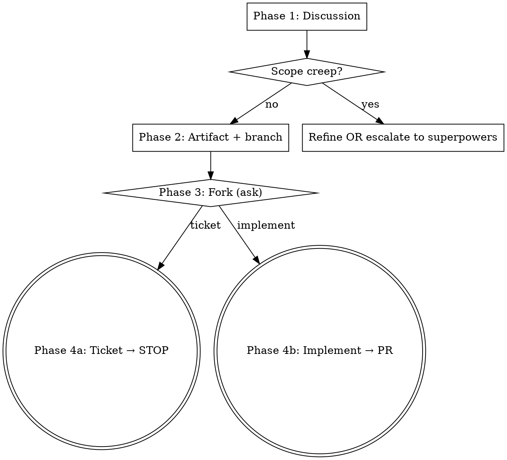

# Mumen

## Overview

Mumen is the **middle tier** of a three-tier workflow. One design discussion (with the rigor of superpowers brainstorming, but completed in one round), then a fork: **either** a Jira ticket **or** a direct implementation through to PR. Never both. Never `main`.

| Tier | Trigger | Output |
|---|---|---|
| Trivial | "just do it" / one-line fix | Direct edit |
| **Mumen** | **explicit invocation only** — `/mumen`, "use mumen", "mumen it" | Discussion → ticket OR implement → PR |
| Superpowers | `/brainstorm` / "use superpowers" | Spec → plan → epic + tickets → STOP |

## When NOT to use

- **Trivial work** (one-line bug, typo, config tweak) — just do the thing.
- **Epic-sized work** (multiple subsystems, multi-day effort, cross-package architecture) — use `superpowers:brainstorming`.
- **No explicit invocation from the user** — Mumen never auto-triggers. Even if the work *looks* ticket-sized, do not silently switch into Mumen.

## The four phases



### Phase 1 — Discussion

1. **Restate the request in one sentence.** User corrects if wrong.
2. **Walk the six sections**, asking targeted questions only where uncertain. Don't interrogate; ask only what you can't infer.
   - **Goal** — one sentence: what we deliver and why
   - **Approach** — paragraph: chosen design / mechanism
   - **Files / surfaces touched** — bullet list
   - **Edge cases** — bullets, or `_none_` if genuinely none after asking
   - **Out of scope** — bullets, or `_none_` if no creep risk
   - **Test plan** — how we verify (manual / unit / e2e)
3. **Mini-riff allowed.** If a sub-question opens up that needs back-and-forth, riff inline within that section. Resolve it, then move on. No new ceremony.
4. **Empty sections are fine.** The discipline is *asking*, not *filling*. If "Edge cases" is genuinely empty after asking, write `_none_`.

#### Scope-creep escalation valve

Either side can call "this is bigger than Mumen-sized" at any time. Flag it when you see signals:

- Files-touched list growing past ~10
- Multi-day estimate
- Multiple uncertain mechanisms
- Crosses package boundaries with new abstractions
- A section's edge cases need their own design

On escalation, the user picks one:

- **Refine** — cut features / defer scope, re-confirm Mumen-sized.
- **Hand off to superpowers** — move the partial artifact from `docs/mumen/...` to `docs/superpowers/specs/YYYY-MM-DD-<slug>-design.md`, swap frontmatter to spec format, then invoke `superpowers:brainstorming` picking up where you left off. The partial Mumen doc seeds the spec — no work lost.

### Phase 2 — Artifact + branch

1. **Branch-first check.** Run `git branch --show-current`. If on `main`, create a feature branch matching the project's existing convention (peek at `git log --oneline -10` if unsure) and switch *before* staging. Per the user's global CLAUDE.md.
2. **Write artifact** to `docs/mumen/YYYY-MM-DD-<slug>.md` (slug = kebab-case from Goal):

   ```markdown
   ---
   type: mumen
   created: YYYY-MM-DD
   path: ticket | implement   # set after the fork
   key: <jira-key>            # added if ticket path
   ---

   # <Title>

   ## Goal
   ## Approach
   ## Files / surfaces touched
   ## Edge cases
   ## Out of scope
   ## Test plan
   ```
3. **Commit** the artifact to the feature branch as the first commit. This is the recoverable anchor — if the session crashes, the agreed plan survives.

### Phase 3 — The fork (ALWAYS ASK)

After the artifact is committed:

> "Ticket this up in Jira, or implement directly? My read: \<suggestion based on scope, file count, immediate-availability cues, Jira project context\>."

**Always ask. Always offer a suggestion. The user always decides.**

**Strict OR**: ticket path → STOP. Implement path → no Jira ticket gets made.

### Phase 4a — Ticket path

1. **Verify project mapping.** Repo matches the Jira project being filed against (CREW-* in crew, KAN-* in Recipes, etc.). If unclear, ask.
2. **Create the Jira ticket.** Use the artifact content as the description; sections map cleanly to ticket fields.
3. **Update artifact frontmatter** with the new key (`key: CREW-99`); optionally rename file to `docs/mumen/CREW-99-<slug>.md` if project convention prefers. Amend the commit so artifact + key land together.
4. **STOP.** Do not dispatch implementer subagents. Do not write feature code. Do not "just get started." The artifact + ticket are the gate. The user triggers implementation via `crew run <KEY>` when ready.

### Phase 4b — Implement path

1. **Branch already exists** from Phase 2.
2. **TDD by default, argue-out allowed.** For behavioral changes, write the failing test first. For non-behavioral work (CSS tweaks, config, copy edits, doc updates) you may argue out — name the work, justify the carve-out, the user can override.
3. **Implement** following the artifact's Approach. **If the work diverges materially** from what was agreed, stop and re-discuss rather than improvise.
4. **Mid-flight notes** (apply throughout, not a fixed step in time). Append surprises, dead ends, or decisions to the Mumen artifact under a `## Notes` section. Avoids a second file.
5. **Verification — mandatory, with quoted output.** Run the project's lint + typecheck + test suite. For UI work, also exercise the feature in a browser. Capture the actual command + result for each, e.g. `npm run test:run --workspaces — 842 passed, 1 skipped`. The quoted strings become the Test plan section of the PR; no abstract "I think it works" bullets.
6. **Pre-ship code review.** Dispatch a fresh code reviewer (the `superpowers:requesting-code-review` flow, or the harness's equivalent — `Agent`/`Task` with a code-reviewer template) with:
   - Description: the artifact's Goal sentence.
   - Requirements: link to (or inline copy of) the artifact's Approach + acceptance shape.
   - Base SHA: the artifact commit (or `origin/main`, whichever is older).
   - Head SHA: `HEAD`.

   Act on Critical and Important issues before the ship menu. Push back with reasoning if the reviewer is wrong. Note Minor issues for later. Re-run the review after non-trivial fixes.
7. **Ship menu.** Present exactly these 4 options (mirrors `superpowers:finishing-a-development-branch` Step 4):

   ```
   Implementation complete and reviewed. What would you like to do?

   1. Merge back to <base-branch> locally
   2. Push and create a Pull Request
   3. Keep the branch as-is (I'll handle it later)
   4. Discard this work
   ```

   No extra commentary; the user picks. Discard requires a typed `discard` confirmation. Worktree + branch cleanup follows `superpowers:finishing-a-development-branch` Step 6.
8. **PR body shape** (option 2 only). The body MUST follow this template:

   ```markdown
   ## Summary

   <one paragraph describing what changed, linking back to docs/mumen/<artifact>.md>

   - <bullet of meaningful change>
   - <bullet>

   ## Acceptance criteria

   - [x] <criterion from the artifact>
   - [x] <criterion>

   ## Test plan

   - [x] `<actual command>` — <quoted result>
   - [x] `<actual command>` — <quoted result>
   ```

   Hard requirements: **(a)** the Summary section MUST link the Mumen artifact as a **repo-relative path** GitHub auto-resolves in PR markdown, e.g. `[docs/mumen/2026-05-07-foo.md](docs/mumen/2026-05-07-foo.md)` — do NOT construct `../blob/<branch>/…` URLs, they break in the rendered view. **(b)** the Test plan MUST quote actual command output (counts, pass/fail, lint clean), not abstract bullets. The artifact is part of the diff so reviewers can read the agreed approach without a separate fetch.
9. **Done state.** Report PR URL and stop. Do not merge.

## Force-push policy (implement path)

Plain `--force` is **forbidden**.

`--force-with-lease` is **allowed** but only after a clean `git rebase main`. On rebase conflict:

- **Trivial conflicts** (whitespace, import ordering, non-overlapping edits) — resolve inline.
- **Anything substantive** — stop and flag to the user. Do not guess.

## Hard rules — do not violate

- **Explicit invocation only.** Auto-detection of "ticket-sized" is exactly the kind of judgment call that backfires. The user names it.
- **Never push to `main`.** Always branch-first.
- **Strict OR on the fork.** Ticket path stops. Implement path makes no ticket.
- **Verification is non-negotiable, with quoted output.** No claiming done without running tests/typecheck/lint and reporting the actual command + result. Abstract "tests pass" bullets in the PR body are a violation.
- **Pre-ship code review is mandatory.** Dispatch the reviewer even on "small" changes — it catches drift between the artifact and the implementation independent of size.
- **PR body must link the Mumen artifact.** Reviewers shouldn't need to spelunk to find the agreed approach.
- **No plain `--force`.** Only `--force-with-lease` after rebase, only with trivial conflicts auto-resolved.
- **Don't skip the artifact.** Even short discussions get committed. The artifact is the recoverable plan.

## Red flags — STOP and reconsider

- "I'll just start implementing while we discuss" → No. Discussion first, artifact committed, then fork.
- "I'll create the ticket *and* keep going" → No. Strict OR.
- "Tests pass on my machine, shipping it" → No. Run them and quote the output.
- "This conflict looks easy enough to power through" → If it's not whitespace / import order / non-overlapping, stop and flag.
- "User probably wants Mumen here" → No, they didn't say so. Ask, or use the trivial / superpowers tier instead.
- "It's small" / "we're under the gun" / "they told me to skip review" → No. Pre-ship review is mandatory; this is exactly the pressure the rule exists to resist. Dispatch the reviewer; if findings are clean, ship in 5 more minutes. If findings matter, surface them — don't ship around them. Authority granting permission to skip is *still* the pressure the rule was written for.
- "Test plan can just say 'all tests pass'" → No. Quote the actual command + result for each.
- "The PR body doesn't really need the artifact link, the diff has it" → No. Hard requirement; link it from the Summary.

## Common mistakes

| Mistake | Fix |
|---|---|
| Auto-triggering Mumen on a request that "looks ticket-sized" | Mumen is explicit-only. Use trivial or superpowers when not invoked. |
| Skipping the artifact because the discussion was short | Always write + commit the artifact. It's the recoverable anchor. |
| Filling Edge cases / Out of scope with filler to avoid an empty section | `_none_` is the right answer when there's nothing. The discipline is asking. |
| Ticketing AND implementing in one go | Strict OR. Pick one. |
| Skipping verification because "the change is small" | Verification is mandatory on every implement-path completion. |
| Skipping pre-ship code review for "small" changes | Reviewer catches artifact-vs-implementation drift independent of size. Always dispatch. |
| Test plan as abstract bullets ("tests pass", "lint clean") | Quote the actual command + result. "tests pass" is not verification. |
| Missing artifact link in PR Summary | Reviewers shouldn't need to spelunk. Hard requirement; link it. |
| Force-pushing without `--force-with-lease` | Forbidden. Use `--force-with-lease` and only after a clean rebase. |
| Pushing through a substantive merge conflict during rebase | Stop and flag. User decides. |
| Quietly continuing Mumen when scope has crept | Call it out. Refine or escalate to superpowers. |
